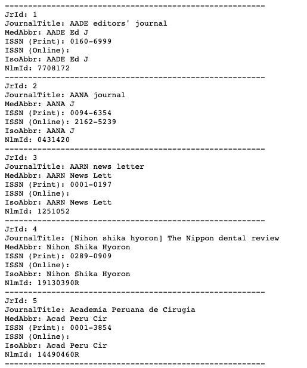

```{r setup, include=FALSE}
knitr::opts_chunk$set(echo = FALSE, message = FALSE, warning = FALSE)
```


```{r import library}
library(tidyverse)
library(readxl)
library(here)
library(janitor)
library(downloadthis)
```

You can use PubMed website to reach to the [List of All Journals Cited in PubMed](https://www.nlm.nih.gov/bsd/serfile_addedinfo.html).  

The link ["Pubmed journal list"](https://ftp.ncbi.nih.gov/pubmed/J_Medline.txt) directs you to the .txt file. You can download/save it.  
or you can directly (by using read_tsv()) download the file from [ftp link](ftp://ftp.ncbi.nih.gov/pubmed/J_Medline.txt).

```{r}
## from pubmed database -> https://www.nlm.nih.gov/bsd/serfile_addedinfo.html
## from ftp -> ftp://ftp.ncbi.nih.gov/pubmed/J_Medline.txt

pubmed_journal_downloaded <- read_tsv("ftp://ftp.ncbi.nih.gov/pubmed/J_Medline.txt",
                        col_names = "pubmed") 

```
<br>

# Original version (txt file)  
Here is the example how it looks in PubMed website. The dataset actually has `r nrow(pubmed_journal_downloaded)` rows with one column (>8 mb). 


```{r, eval = FALSE}
# the file is > 8mb. So, You can download it as a local file first. and then read it from local.  
# or you can use {r, cache = TRUE} option. 
# But be careful about the updates in the file. Using {cache.extra = tools::md5sum("")} option may be needed.

# pubmed_journal_list <- read_tsv("./data/downloaded-data/J_Medline.txt",
#                         col_names = "pubmed")
```
<br>
```{r}
pubmed_journal_list <- pubmed_journal_downloaded %>%         
  filter (!str_starts(pubmed, "\\-"))               


pubmed_journals_wide <- pubmed_journal_list %>%  
  mutate (row_number = paste0("jour", rep(1:(nrow(pubmed_journal_list)/7), each = 7)), .before = "pubmed",
          pubmed = replace(pubmed, pubmed=="ISSN (Online):", "ISSN (Online): " ),
          pubmed = replace(pubmed, pubmed=="ISSN (Print):", "ISSN (Print): " ),
          pubmed = replace(pubmed, pubmed=="MedAbbr:", "MedAbbr: " ),
          pubmed = replace(pubmed, pubmed=="IsoAbbr:", "IsoAbbr: " )) %>% 
  separate(pubmed, c("variable", "text"), sep = ": ", fill = "right") %>% 
  # mutate (text = str_trim(text)) %>% 
  pivot_wider (names_from = "variable", values_from = "text") %>% 
  clean_names() %>% 
  select(-row_number)
```


```{r}
pubmed_journals_all <- pubmed_journals_wide %>% 
  # mutate(issn_online = noquote(issn_online)) %>% 
   # mutate_at (.vars= c("issn_print","issn_online"),
   #           .funs = list(~ifelse(. == "", "", as.character(.)))) %>% 
  mutate (journal_title = str_to_title(journal_title),
          journal_title = str_replace_all(journal_title, "[[:punct:]]", ""),
          journal_title = str_trim(journal_title),
          issn_online = str_replace_all(issn_online,"^$", NA_character_)) %>% 
  select(-iso_abbr) %>% 
  rename("Journal ID" = "jr_id",
         "Journal Name" = "journal_title",
         "Abbreviation" = "med_abbr",
         "ISSN (Print)" = "issn_print",
         "ISSN (Electronic)" = "issn_online",
         "NLM ID" = "nlm_id")
```


```{r, eval = FALSE}
# If you want to save your file locally, use this.
# writexl::write_xlsx(pubmed_journals_all,"data/processed-data/pubmed_list_2022.xlsx")
```

```{r, eval = FALSE}
# Corrected format in DT
# If you want to see as datatable, use this. The data is too big for client-side datatables.
pubmed_journals_all %>%
  DT::datatable(fillContainer = FALSE, caption = "List of Journals Cited in PubMed")
```

# Corrected format
This is an example how it looks. 
```{r}
pubmed_journals_all %>% 
  head(10) %>% 
  knitr::kable()
```


<br><br>

# Download link
```{r}
pubmed_journals_all %>%
  download_this(
    output_name = "PubMed Journal List",
    output_extension = ".xlsx",
    button_label = "Download full list as an excel file",
    button_type = "success",
    has_icon = TRUE,
    icon = "fa fa-save"
  )
```
<br><br>

{}
If you want to see/reuse the codes, please use above **GitHub** link.
{}
